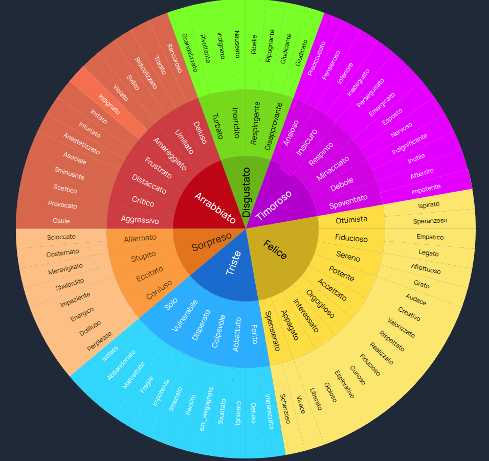
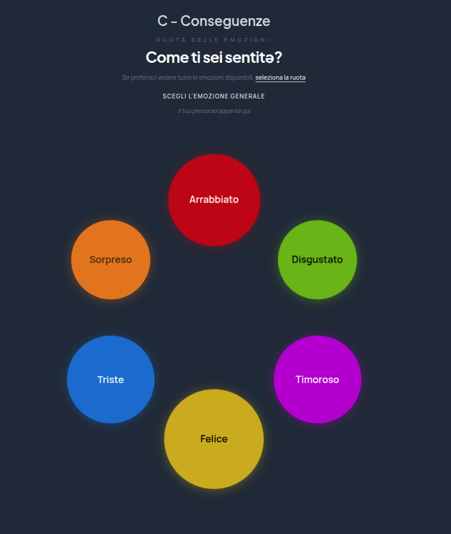

# Diario ABC
 
🇬🇧 [Read in English](README.md)
 
---
 
Un diario delle emozioni privato, interamente nel browser, costruito attorno al modello ABC della Terapia Cognitivo-Comportamentale. Identifica le tue emozioni, compila il modulo strutturato ed esporta un PDF pulito da condividere con il tuo terapeuta.
 
🔗 Live: [**abc-diary.vercel.app**](https://abc-diary.vercel.app)
 
## Schermate
 
| Ruota delle Emozioni | Visualizzazione a bolle |
|:---:|:---:|
|  |  |
 
## Panoramica
 
L'app segue la struttura TCC a tre sezioni:
 
* **A — Situazione** — cosa è successo, quando, dove e con chi
* **B — Pensieri** — cosa ti è passato per la mente
* **C — Conseguenze** — come ti sei sentito, cosa hai fatto e cosa avresti voluto fare diversamente
 
Sono disponibili due viste per identificare la tua emozione:
 
**Ruota delle Emozioni** — Un grafico circolare con tre anelli concentrici. L'anello più interno mostra le categorie emotive generali (Arrabbiato, Felice, Triste…). 

**Visualizzazione a bolle** — Le sei emozioni principali sono mostrate come bolle colorate. Toccando una bolla questa si espande nelle sue sotto-emozioni, ciascuna rappresentata da una bolla più piccola dello stesso colore. Una volta selezionata, una scala di intensità da 1 a 10 ti permette di valutarne l'intensità.
 
## Funzionalità
 
* Ruota delle Emozioni interattiva
* Visualizzazione a bolle con navigazione drill-down e valutazione dell'intensità
* Italiano e inglese
* Esportazione PDF con un click
* Totalmente privato — nessun backend, nessun tracciamento, i dati non lasciano mai il dispositivo
 
## Privacy
 
Tutti i dati sono conservati esclusivamente in memoria e cancellati alla chiusura della pagina. L'unico dato persistente è la preferenza della lingua, salvata in `localStorage`. Nulla viene trasmesso all'esterno.
 
## Esecuzione in locale
 
```bash
git clone https://github.com/WhtNoiz/diario-abc.git
cd abc-diary
npm install
npm run dev
```
 
## Licenza
 
© 2026 WhtNoiz — **CC BY 4.0**
 
